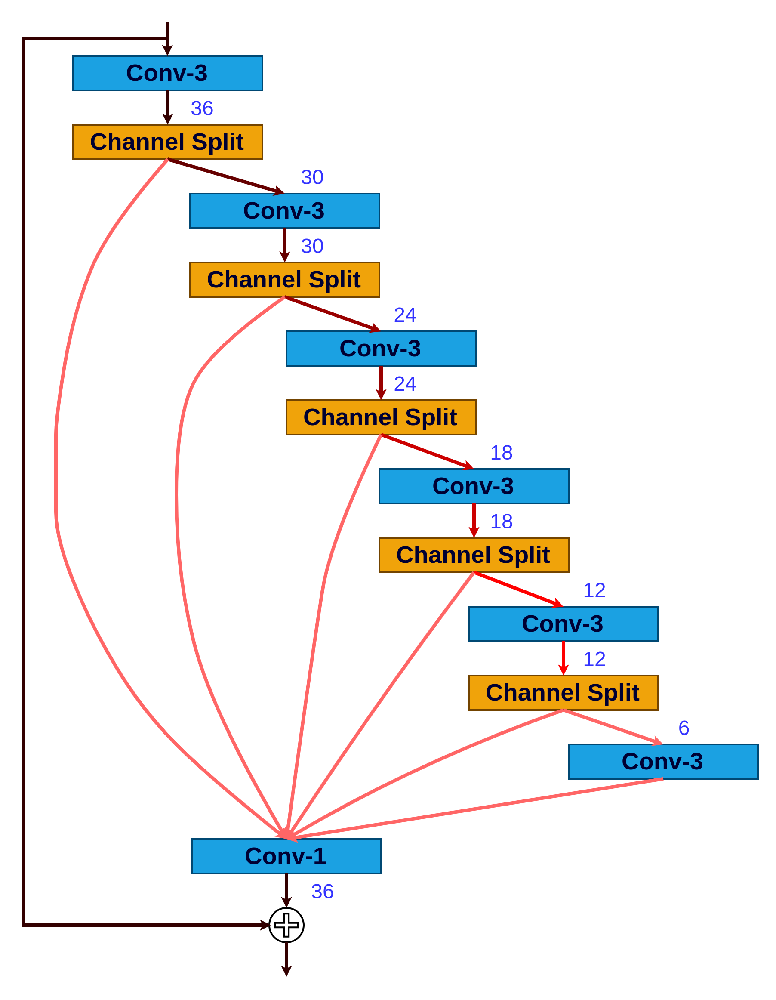
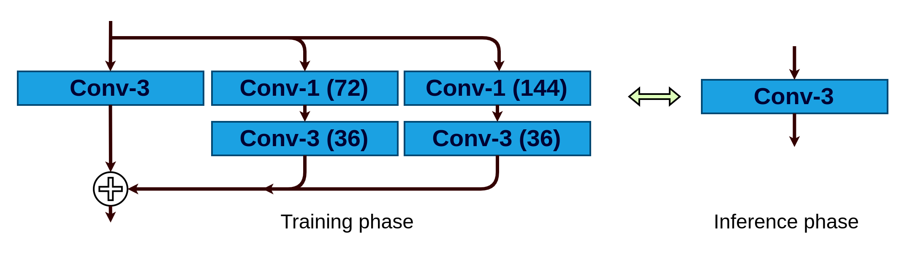
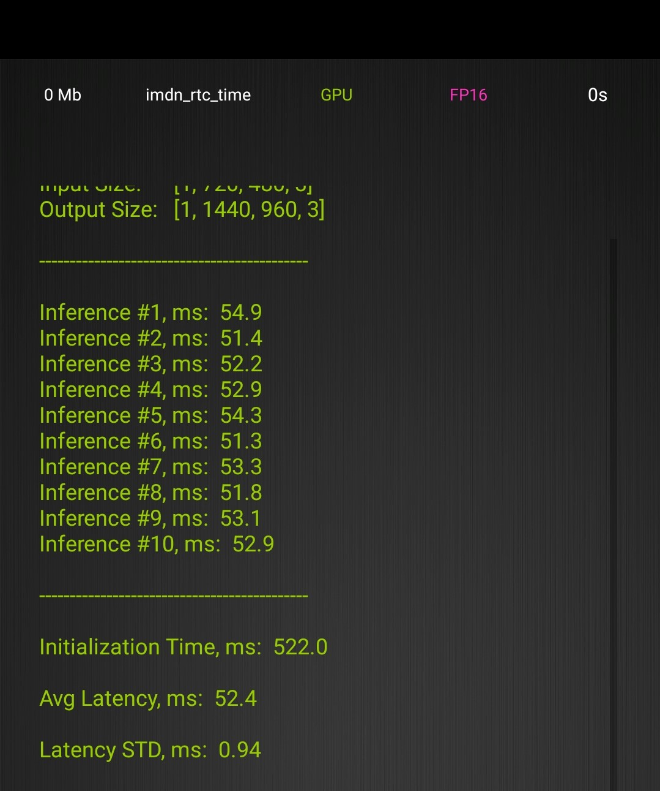
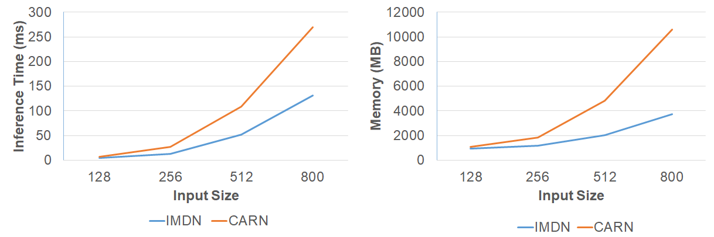
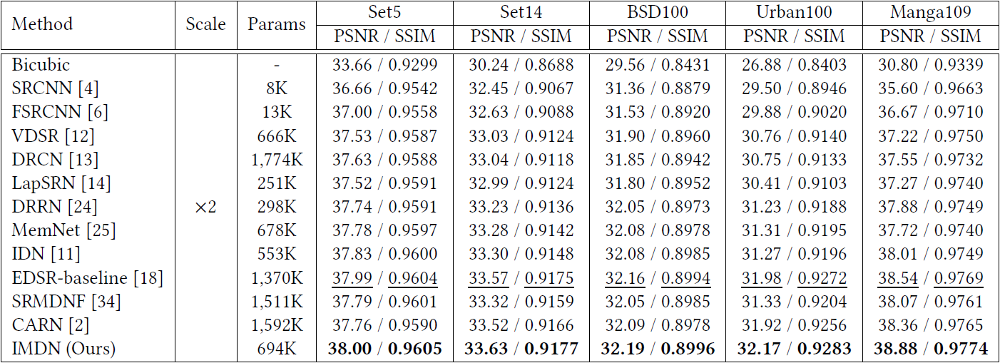
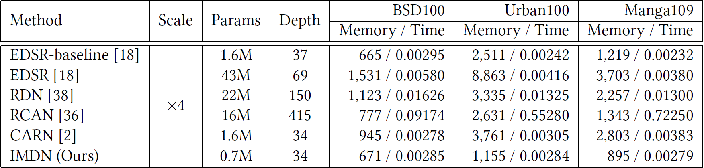
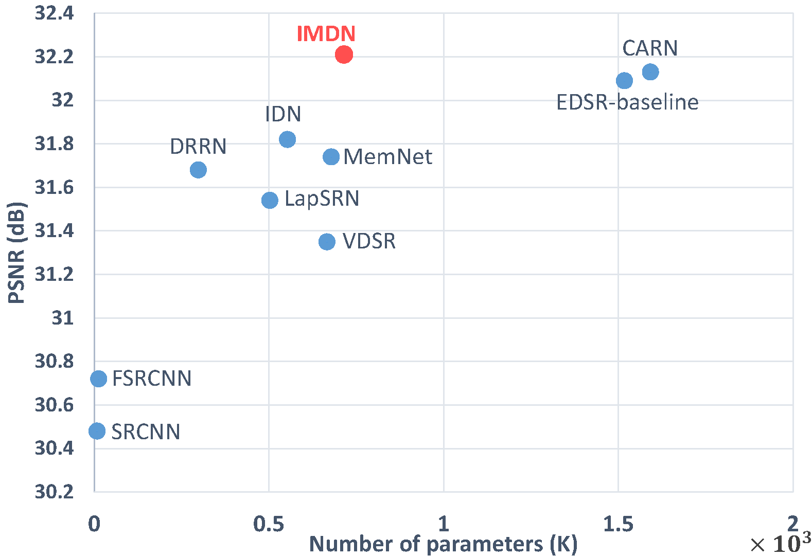
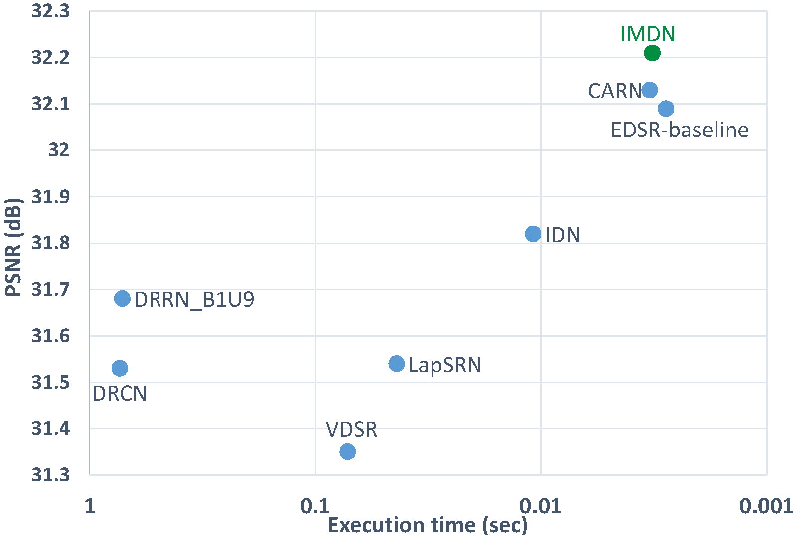
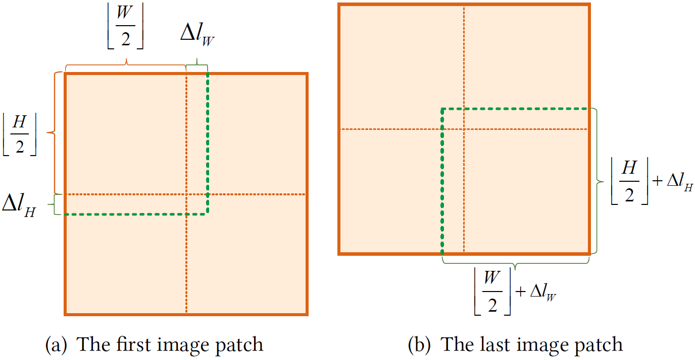
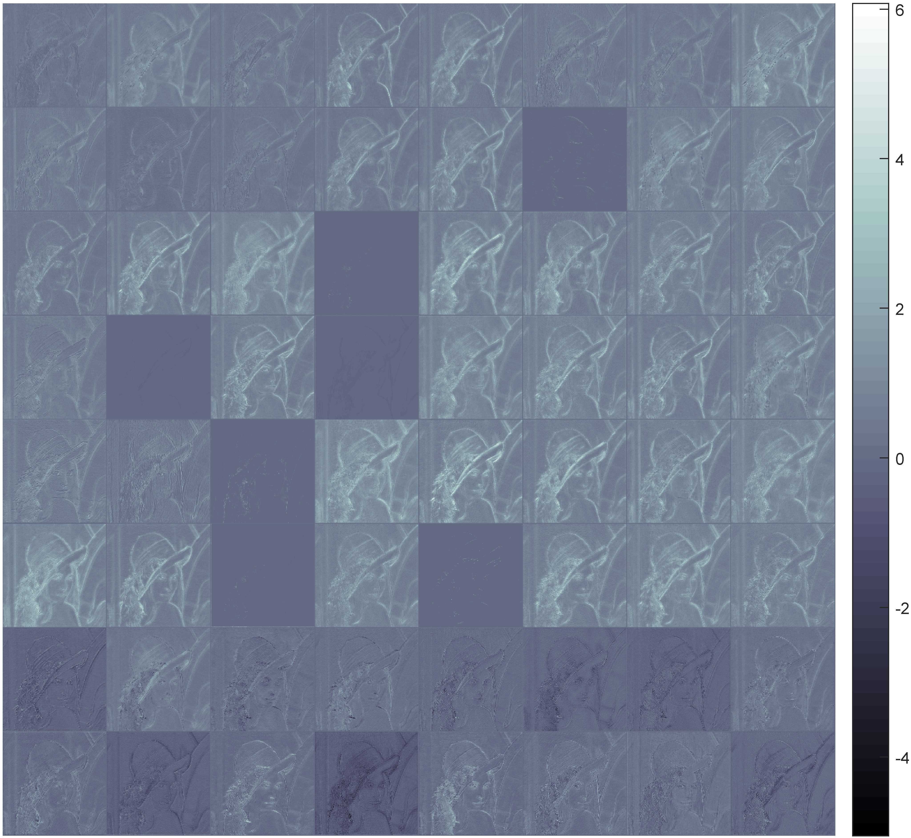

# IMDN
Lightweight Image Super-Resolution with Information Multi-distillation Network (ACM MM 2019)

[[arXiv]](https://arxiv.org/pdf/1909.11856v1.pdf)
[[Poster]](https://github.com/Zheng222/IMDN/blob/master/images/acmmm19_poster.pdf)
[[ACM DL]](https://dl.acm.org/citation.cfm?id=3351084)

## :sparkles: News
- Nov 26, 2021. **Add IMDN_RTC tflite model.**

# [CVPR 2022 Workshop NTIRE report](https://github.com/ofsoundof/IMDN)
The IMDN+ got the **Second Runner-up** at NTIRE 2022 Efficient SR Challenge (Sub-Track2 - Overall Performance Track).

<table align='center'>
    <tr>
        <td align='center'>
             <br />
            <em> IMDB+ </em>
        </td>
        <td align='center'>
             <br />
            <em> structural re-parameterization </em>
        </td>
    </tr>
</table>


##### Model complexity
| <sub> number of parameters </sub> | <sub> 275,844 </sub> |
|:---:|:---:|
| <sub> FLOPs </sub> | <sub> 17.9848G (input size: 3*256*256) </sub> |
| <sub> GPU memory consumption </sub> | <sub> 2893M (DIV2K test) </sub> |
| <sub> number of activations </sub> | <sub> 92.7990M (input size: 3*256*256) </sub> |
| <sub> runtime </sub> | <sub> 0.026783s (RTX 2080Ti, DIV2K test) </sub> |


##### PSNR / SSIM (Y channel) on 5 benchmark datasets.
| <sub>Metrics</sub> | <sub>Set5</sub> | <sub>Set14</sub> | <sub>B100</sub> | <sub>Urban100</sub> | <sub>Manga109</sub> |
|:---:|:---:|:---:|:---:|:---:|:---:|
| <sub>PSNR</sub>| <sub>32.11</sub> | <sub>28.63</sub> | <sub>27.58</sub> | <sub>26.10</sub> | <sub>30.55</sub> | 
| <sub>SSIM</sub>| <sub>0.8934</sub> | <sub>0.7823</sub> | <sub>0.7358</sub> | <sub>0.7846</sub> | <sub>0.9072</sub> | 


# [ICCV 2019 Workshop AIM report](https://arxiv.org/abs/1911.01249)
The simplified version of IMDN won the **first place** at Contrained Super-Resolution Challenge (Track1 & Track2). The test code is available at [Google Drive](https://drive.google.com/open?id=1BQkpqp2oZUH_J_amJv33ehGjx6gvCd0L)

# [AI in RTC 2019-rainbow](https://www.dcjingsai.com/common/bbs/topicDetails.html?tid=3787)
The ultra lightweight version of IMDN won the **first place** at Super Resolution Algorithm Performance Comparison Challenge. (https://github.com/Zheng222/IMDN/blob/53f1dac25e8cd8e11ad65484eadf0d1e31d602fa/model/architecture.py#L79)

Degradation type: Bicubic

[PyTorch Checkpoint](https://github.com/Zheng222/IMDN/blob/master/checkpoints/model_RTC.pth)

[Tensorflow Lite Checkpoint](https://github.com/Zheng222/IMDN/blob/master/checkpoints/imdn_rtc_time.tflite)

input_shape = (1, 720, 480, 3), AI Benchmark(OPPO Find X3-Qualcomm Snapdragon 870, FP16, TFLite GPU Delegate)




# [AI in RTE 2020-rainbow](https://www.dcjingsai.com/v2/news-detail.html?id=64)
The down-up version of IMDN won the **second place** at Super Resolution Algorithm Performance Comparison Challenge.
(https://github.com/Zheng222/IMDN/blob/53f1dac25e8cd8e11ad65484eadf0d1e31d602fa/model/architecture.py#L98)

Degradation type: Downsampling + noise

[Checkpoint](https://github.com/Zheng222/IMDN/blob/master/checkpoints/model_RTE.pth)
# Hightlights
1. Our information multi-distillation block (IMDB) with contrast-aware attention (CCA) layer.

2. The adaptive cropping strategy (ACS) to achieve the processing images of any arbitrary size (implementing any upscaling factors using one model).

3. The exploration of factors affecting actual inference time.

## Testing
Pytorch 1.1
* Runing testing:
```bash
# Set5 x2 IMDN
python test_IMDN.py --test_hr_folder Test_Datasets/Set5/ --test_lr_folder Test_Datasets/Set5_LR/x2/ --output_folder results/Set5/x2 --checkpoint checkpoints/IMDN_x2.pth --upscale_factor 2
# RealSR IMDN_AS
python test_IMDN_AS.py --test_hr_folder Test_Datasets/RealSR/ValidationGT --test_lr_folder Test_Datasets/RealSR/ValidationLR/ --output_folder results/RealSR --checkpoint checkpoints/IMDN_AS.pth

```
* Calculating IMDN_RTC's FLOPs and parameters, input size is 240*360
```bash
python calc_FLOPs.py
```

## Training
* Download [Training dataset DIV2K](https://drive.google.com/open?id=12hOYsMa8t1ErKj6PZA352icsx9mz1TwB)
* Convert png file to npy file
```bash
python scripts/png2npy.py --pathFrom /path/to/DIV2K/ --pathTo /path/to/DIV2K_decoded/
```
* Run training x2, x3, x4 model
```bash
python train_IMDN.py --root /path/to/DIV2K_decoded/ --scale 2 --pretrained checkpoints/IMDN_x2.pth
python train_IMDN.py --root /path/to/DIV2K_decoded/ --scale 3 --pretrained checkpoints/IMDN_x3.pth
python train_IMDN.py --root /path/to/DIV2K_decoded/ --scale 4 --pretrained checkpoints/IMDN_x4.pth
```

## Results
[百度网盘](https://pan.baidu.com/s/1DY0Npete3WsIoFbjmgXQlw)提取码: 8yqj or
[Google drive](https://drive.google.com/open?id=1GsEcpIZ7uA97D89WOGa9sWTSl4choy_O)

The following PSNR/SSIMs are evaluated on Matlab R2017a and the code can be referred to [Evaluate_PSNR_SSIM.m](https://github.com/yulunzhang/RCAN/blob/master/RCAN_TestCode/Evaluate_PSNR_SSIM.m).

## Pressure Test
<p align="center">
     <br />
    <em> Pressure test for ×4 SR model. </em>
</p>

*Note: Using torch.cuda.Event() to record inference times. 


## PSNR & SSIM
<p align="center">
     <br />
    <em> Average PSNR/SSIM on datasets Set5, Set14, BSD100, Urban100, and Manga109. </em>
</p>

## Memory consumption
<p align="center">
     <br />
    <em> Memory Consumption (MB) and average inference time (second). </em>
</p>

## Model parameters

<p align="center">
     <br />
    <em> Trade-off between performance and number of parameters on Set5 ×4 dataset. </em>
</p>

## Running time

<p align="center">
     <br />
    <em> Trade-off between performance and running time on Set5 ×4 dataset. VDSR, DRCN, and LapSRN were implemented by MatConvNet, while DRRN, and IDN employed Caffe package. The rest EDSR-baseline, CARN, and our IMDN utilized PyTorch. </em>
</p>

## Adaptive Cropping
<p align="center">
     <br />
    <em> The diagrammatic sketch of adaptive cropping strategy (ACS). The cropped image patches in the green dotted boxes. </em>
</p>

## Visualization of feature maps
<p align="center">
     <br />
    <em> Visualization of output feature maps of the 6-th progressive refinement module (PRM).</em>
</p>

## Citation

If you find IMDN useful in your research, please consider citing:

```
@inproceedings{Hui-IMDN-2019,
  title={Lightweight Image Super-Resolution with Information Multi-distillation Network},
  author={Hui, Zheng and Gao, Xinbo and Yang, Yunchu and Wang, Xiumei},
  booktitle={Proceedings of the 27th ACM International Conference on Multimedia (ACM MM)},
  pages={2024--2032},
  year={2019}
}

@inproceedings{AIM19constrainedSR,
  title={AIM 2019 Challenge on Constrained Super-Resolution: Methods and Results},
  author={Kai Zhang and Shuhang Gu and Radu Timofte and others},
  booktitle={The IEEE International Conference on Computer Vision (ICCV) Workshops},
  year={2019}
}

```
